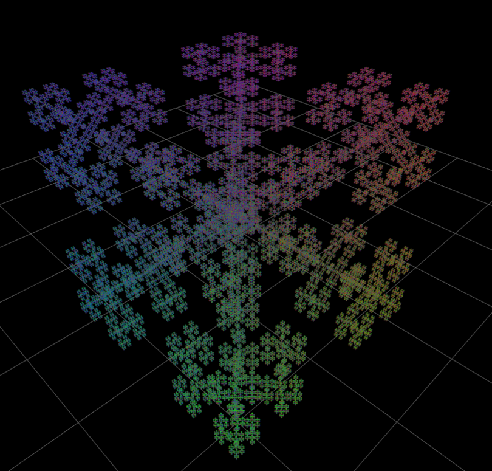
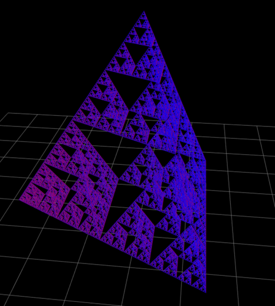
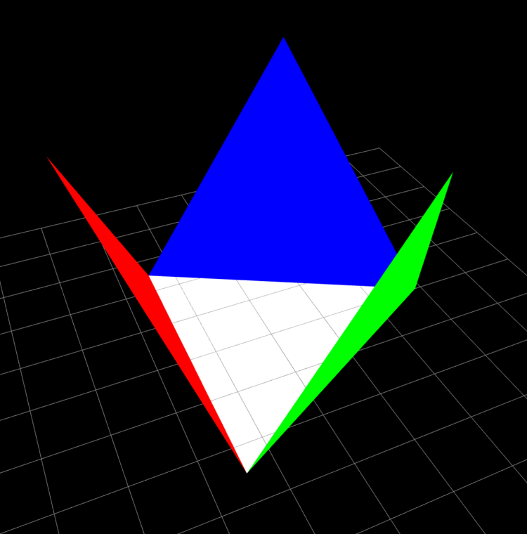

# 3D IFS Fractals

A visualization of different [iterated function systems (IFS)](https://en.wikipedia.org/wiki/Iterated_function_system) fractals using [Three.js](https://github.com/mrdoob/three.js/).

This was my submission for the university lecture [186.186 Fractals](https://www.cg.tuwien.ac.at/courses/2019W/Fraktale/UE)

  
  &nbsp;&nbsp;
  
  &nbsp;&nbsp;
  

## Code Description

The 3D fractals are implemented by placing base objects (like tetrahedra) at recursively calculated positions using instancing, scaled according to their respective iteration level. To improve performance, all positions are pre-calculated and stored in buffers during initialization. At runtime, the user can select up to which iteration depth the fractal should be displayed.

The movement of the Sierpinski tetrahedron is controlled by 8 matrices, which are passed as uniforms to the vertex shader. A "mask" buffer determines which matrix should be applied to each vertex. The first 4 matrices describe the initial movement where the 3 outer triangles fold inward. The remaining 4 matrices then describe the folding of the inner sub-triangles of all 4 triangular faces.

Additionally, this visualization also includes other simple fractals based on cubes (like [Cantor Dust](https://en.wikipedia.org/wiki/Cantor_set#Cantor_dust) and [Menger Sponge](https://en.wikipedia.org/wiki/Menger_sponge)) without iteration animation.

## Controls

### Camera

- **Left Mouse Button**: Rotate camera
- **Right Mouse Button**: Pan camera
- **Mouse Wheel**: Zoom

### Interface

- Fractal type selector
- Animation speed control (0.125x - 8x)
- Information display ([Hausdorff dimension](https://en.wikipedia.org/wiki/Hausdorff_dimension), iteration depth, instance count)
- Timeline controls:
  - Play/Pause
  - Stop/Reset
  - Reverse Direction
  - Timeline scrubbing

## Usage

Open `index.html` in any WebGL-supported browser or check it out [online](https://dominikscholz.github.io/IFS-fractals/).
